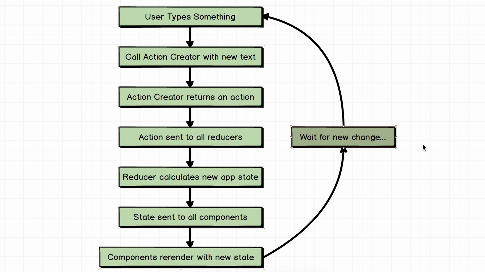
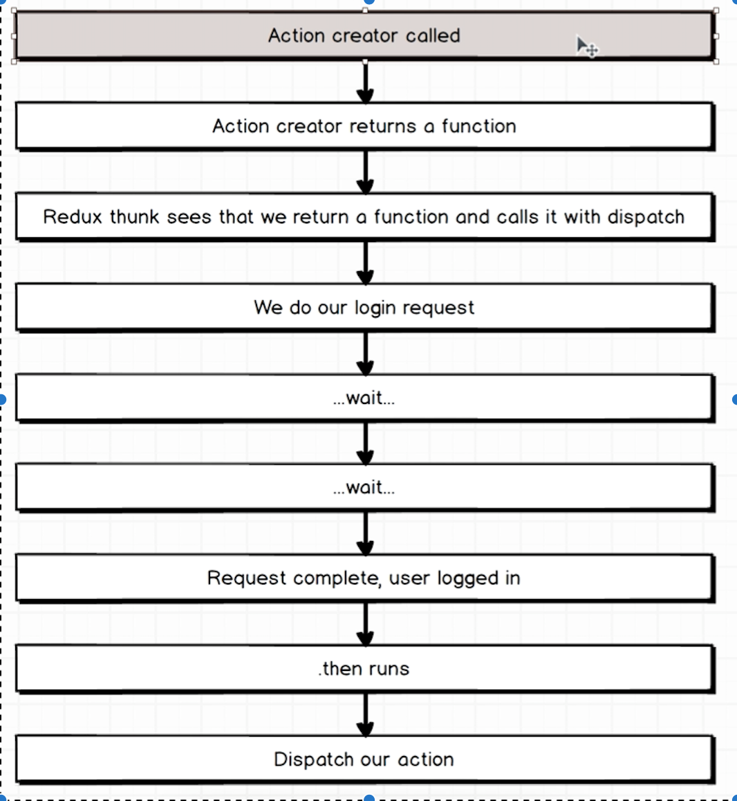

# Refactoring the login form:

- Login Form (React) should be as dumb as possible (just handle the user interactions and show new stuffs)
- every logic should be in Redux 
- to make sure not to make typos lets do the following constants to hold action types: 

# Action for async calls

- Redux thunk: handle async (middleware)
- Action Creator WITHOUT thunk: -- function, which must return an action -- Action is an object with a type property
- Action Creator WITH thunk: -- function, which must return a function -- this function will be called with 'dispatch' -- we need to wire up an action to use redux-thunk 

# Navigation

- there is no de-facto solution
- `react-native-router-flux`
- scenes comes to `Router.js`
- routing with `{type:'reset'}` no back button

# ListView

- datasource cloneWithRows only accepts array, but firebase provides us an object. this needs to be converted
